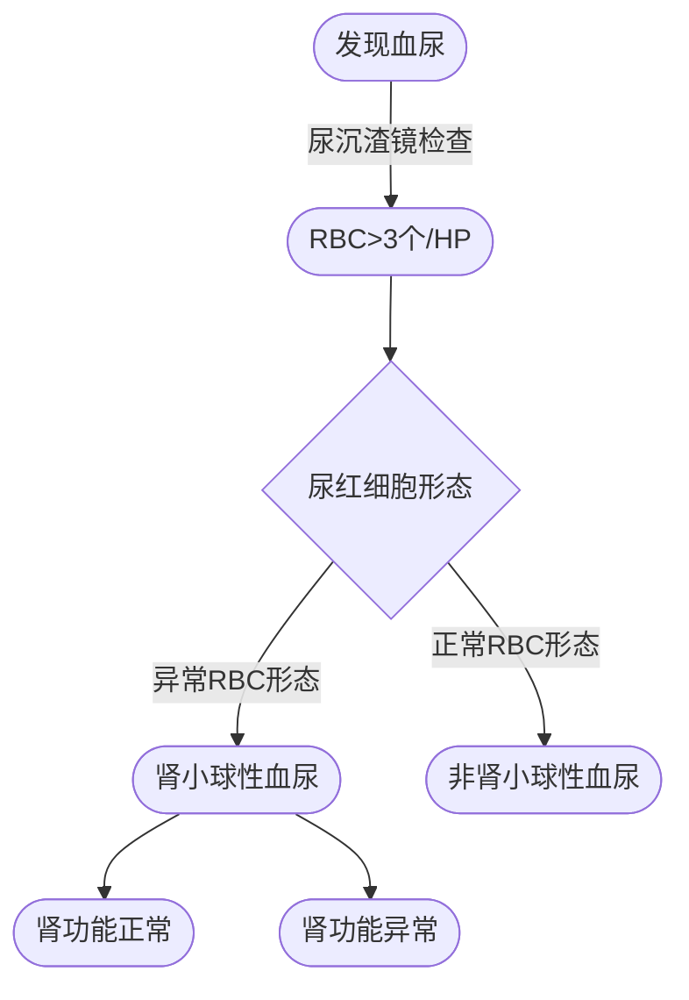

```mermaid

graph TD 


a([发现血尿]) --尿沉渣镜检查-->b([RBC>3个/HP])
b --> c{尿红细胞形态}
c --> |异常RBC形态| d([肾小球性血尿])
d --> d1([肾功能正常])
d --> d2([肾功能异常])


c --> |正常RBC形态| e([非肾小球性血尿])

%%click a alert "lalal" %% 只有在渲染成为html文件时候才有用

%%classDef classA fill:#f9f,stroke:#333,stroke-width:4px;
%%class a,b,c,d classA;


%%classDef classB fill:#aaffaa,stroke:#222,stroke-width:2px;
%%class d1,d2 classB;


```