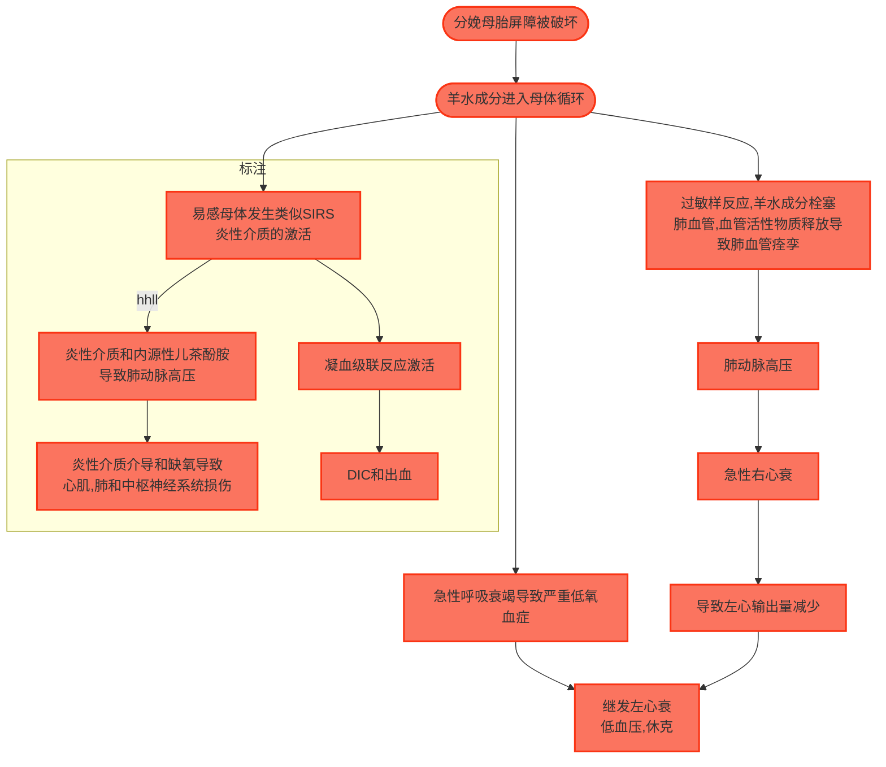

```mermaid


graph TD 


a([分娩母胎屏障被破坏]) -->b([羊水成分进入母体循环])
b --> c1[过敏样反应,羊水成分栓塞<br>肺血管,血管活性物质释放导致肺血管痊孪]
b --> c2[急性呼吸衰竭导致严重低氧血症]
b --> c3[易感母体发生类似SIRS<br>炎性介质的激活]
c1 --> d[肺动脉高压]
d --> e[急性右心衰]
e --> f[导致左心输出量减少]
c2 --> f1[继发左心衰<br>低血压,休克]
f --> f1

subgraph 标注
c3 --hhll--> e1[炎性介质和内源性儿茶酚胺<br>导致肺动脉高压]
c3 --> e2[凝血级联反应激活]
e1 --> f2[炎性介质介导和缺氧导致<br>心肌,肺和中枢神经系统损伤]
e2 --> f3[DIC和出血]
end


classDef classA fill:#FB745F,stroke:#FA3414,stroke-width:2px;
class a,b,c1,c2,c3,d,e1,e2,e,f,f1,f2,f3 classA;
```
